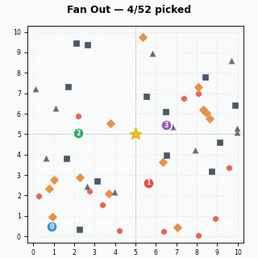

# 52 Card Pickup — Multi-Agent Simulation

[](https://github.com/violethawk/Fifty-Two-Card-Pickup/actions/workflows/ci.yml)

[](LICENSE)
[](https://fifty-two-card-pickup-8jejcgq3c4mwhdkp3emyb3.streamlit.app/)

The canonical "hello world" for multi-agent LLM systems. Simple enough to understand in 5 minutes, deep enough to teach every concept that matters.

**What you'll learn:**
- Multi-agent orchestration with shared state (LangGraph)
- Fan-out/convergence patterns with real cost tradeoffs
- LLM-as-supervisor and LLM-as-worker architectures
- Conflict resolution, observability, and governance guardrails
- Reproducible benchmarking across scatter patterns

52 playing cards are scattered on a 10x10 grid. Agents fan out to pick them up, then converge on a central verifier station to deliver their cards. The project progresses through five phases, each adding one layer of complexity — from pure Python functions to LLM-powered agents with conflict resolution, observability, and a plugin architecture.

Built with [LangGraph](https://github.com/langchain-ai/langgraph) and [Claude](https://www.anthropic.com/claude).

**[Try the live demo](https://fifty-two-card-pickup-8jejcgq3c4mwhdkp3emyb3.streamlit.app/)** — no install needed.

## Architecture


The pipeline has two core phases: **Fan Out** (agents scatter to pick up cards in their assigned regions) and **Converge** (agents travel to the central verifier station to deliver). The delivery mechanic adds a meaningful cost tradeoff — more agents pick up faster but spend more time traveling back to the verifier, changing which configurations are optimal for each scatter pattern.

## Interactive Web App



The Streamlit app offers three modes, each building on the last:

| Mode | Description |
|------|-------------|
| **Human Only** | You click all 52 cards one by one, then deliver to the verifier. A hands-on feel for the problem space. |
| **Agent Assist** | Agents pick up cards automatically while you click to help — race the agents and see who contributes more. Human clicks take priority over agent targeting. |
| **Agent Simulation** | Fully automated. Configure 1, 2, or 4 agents, watch animated pickup and delivery with agent trails, compare configurations side-by-side, and run the full benchmark suite. |

The interactive modes use a custom HTML5 canvas component for instant click-to-pick feedback — no server round-trip for visual updates.

```bash
streamlit run app.py
```

Or use the **[live demo](https://fifty-two-card-pickup-8jejcgq3c4mwhdkp3emyb3.streamlit.app/)**.

## Quick Start

```bash
git clone https://github.com/violethawk/Fifty-Two-Card-Pickup.git
cd Fifty-Two-Card-Pickup
python3 -m venv .venv
source .venv/bin/activate
pip install -r requirements.txt

# Phase 1 — no API key needed
python -m card_pickup --phase 1

# Benchmarks — all scatter patterns, all configs
python -m card_pickup --benchmark

# Full suite — needs ANTHROPIC_API_KEY
export ANTHROPIC_API_KEY=your-key-here
python -m card_pickup
```

## Sample Output

### Phase 1 — Scaling Experiment

```
=== Phase 1: Brute-Force Scaling Experiment ===

| Agents | Avg Time (s) | Best (s) | Worst (s) | Verifier |
|--------|--------|--------|--------|--------|
| 1 | 0.3585 | 0.2971 | 0.4201 | 10/10 ✓ |
| 2 | 0.2434 | 0.2163 | 0.2735 | 10/10 ✓ |
| 4 | 0.2153 | 0.1935 | 0.2345 | 10/10 ✓ |
```

More agents pick up faster, but diminishing returns appear due to delivery cost — 4 agents is only 11% faster than 2, compared to the 30% jump from 1 to 2.

### Phase 2 — Supervisor Decision

The Claude Sonnet supervisor analyzes scatter metrics and chooses an agent count:

```
| Trial | Supervisor Choice | Supervisor Time | Best Brute-Force | Match? |
|-------|-------------------|-----------------|------------------|--------|
| 1     | 4 agents          | 0.2349s         | 4 agents         | Yes    |
  Reasoning: Cards are very evenly distributed across all four quadrants
  (13, 12, 13, 14) with a high balance ratio of 0.857, and the moderate
  spatial spread indicates agents will benefit from smaller territories
  to minimize travel distances.

Supervisor matched optimal: 5/5
```

### Phase 4 — Live TUI Dashboard


## Benchmark Patterns


| Pattern | Description | Best | Pickup | Delivery | Total | Why |
|---------|-------------|------|--------|----------|-------|-----|
| `uniform` | Golden-ratio spiral | 4 | 0.1454s | 0.0983s | 0.2437s | Cards near center, delivery is cheap |
| `clustered` | Bottom-left corner | 1 | 0.1483s | 0.0263s | 0.1746s | Short pickup; extra agents waste time on delivery |
| `two_clusters` | Near (1,1) and (9,9) | 1 | 0.1684s | 0.0317s | 0.2000s | Far corners penalize multi-agent delivery |
| `four_clusters` | 13 per quadrant corner | 2 | 0.1458s | 0.0633s | 0.2090s | Balances speed vs. delivery from corners |
| `diagonal` | Along (0,0)-(10,10) | 2 | 0.1463s | 0.0107s | 0.1570s | Cards pass near center, delivery is cheap |
| `edge` | Grid perimeter | 2 | 0.1378s | 0.0526s | 0.1903s | Perimeter-to-center cost favors fewer agents |

Run with `python -m card_pickup --benchmark`. Generate visualizations with `python visualize.py`.

## The Five Phases

| Phase | Name | What it adds | API key? |
|-------|------|-------------|----------|
| 1 | Deterministic Orchestration | Shared state, greedy pickup, delivery, verifier | No |
| 2 | LLM Supervisor | Claude Sonnet decides agent count from scatter analysis | Yes |
| 3 | LLM Pickup Agents | Claude Haiku agents with planning and conflict resolution | Yes |
| 4 | Observability | Event logging, governance guardrails, TUI dashboard | No |
| 5 | Extensibility | Benchmark suite, plugin architecture, tutorials | No |

## Agents

| Agent | Phase | Role |
|-------|-------|------|
| Scatter | 1 | Places 52 cards at random positions on a 10x10 grid |
| Timer | 1 | Records start/stop timestamps around pickup + delivery |
| Pickup | 1 | Greedy nearest-neighbor pickup with region partitioning |
| Delivery | 1 | Agents converge on verifier station (5, 5) with travel cost |
| Verifier | 1 | Checks 52 unique cards, all picked up and delivered, no duplicates |
| Supervisor | 2 | LLM analyzes scatter pattern and decides agent count (optional) |
| LLM Pickup | 3 | LLM-powered agents with planning and conflict resolution |

## CLI Reference

```
python -m card_pickup [options]

Options:
  --phase {1,2,3}        Run only the specified phase (default: all)
  --benchmark            Run benchmark suite across all scatter patterns
  --save-log             Save event logs to JSON files
  --dashboard            Enable live terminal TUI dashboard
  --replay FILE          Replay a saved event log through the dashboard
  --strategy {greedy,llm}  Pickup strategy plugin (default: greedy)
  --provider {anthropic,mock}  LLM provider plugin (default: anthropic)
```

## Project Structure

```
card_pickup/            Core Python package
  __init__.py           Public API re-exports
  __main__.py           Entry point for python -m card_pickup
  _core.py              Agents, state, LangGraph pipeline
components/
  card_grid/            Custom Streamlit component (HTML5 canvas, no build step)
observability.py        Event logging, governance, metrics, TUI dashboard
benchmarks.py           Scatter patterns and benchmark runner
plugins.py              LLM provider and pickup strategy interfaces
visualize.py            Generate PNG visualizations of scatter patterns
app.py                  Streamlit web app — simulation + interactive modes
tests/                  Unit tests (no API key needed)
images/                 Generated scatter pattern and architecture diagrams
docs/                   Tutorials, roadmap, and guides
prompts/                Implementation prompts for each phase
pyproject.toml          Project metadata and dependencies
requirements.txt        Pinned dependencies for pip install
```

## Dependencies

- **langgraph** — state graph orchestration
- **anthropic** — Claude API for supervisor and LLM agents
- **matplotlib** — scatter pattern visualizations and agent simulation rendering
- **streamlit** — interactive web app (+ custom HTML5 canvas component for click-to-pick)
- **pytest** — unit tests
- Python 3.11+ stdlib (`curses`, `concurrent.futures`, `argparse`)

## Extending the Project

**Add a new agent:** See [docs/add_your_own_agent.md](docs/add_your_own_agent.md) for a step-by-step guide.

**Add a new LLM provider:** Implement the `LLMProvider` interface in `plugins.py` and register it in the `PROVIDERS` dict.

**Add a new strategy:** Implement the `PickupStrategy` interface in `plugins.py` and register it in the `STRATEGIES` dict.

**Add a new benchmark pattern:** Write a function returning `List[Card]` in `benchmarks.py` and add it to the `PATTERNS` dict.

## Contributing

Contributions are welcome! This project is designed as a teaching tool, so clarity matters more than cleverness.

1. Fork the repo and create a feature branch
2. Make your changes — keep them focused and well-tested
3. Run `python -m pytest tests/` to verify all tests pass
4. Run `python -m card_pickup --benchmark` to check nothing regressed
5. Open a PR with a clear description of what and why

Good first contributions: new scatter patterns, new pickup strategies, documentation improvements, or Streamlit app enhancements.

## License

[MIT](LICENSE)
