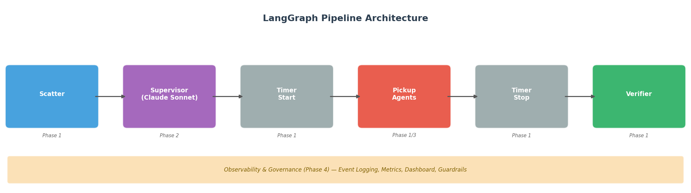
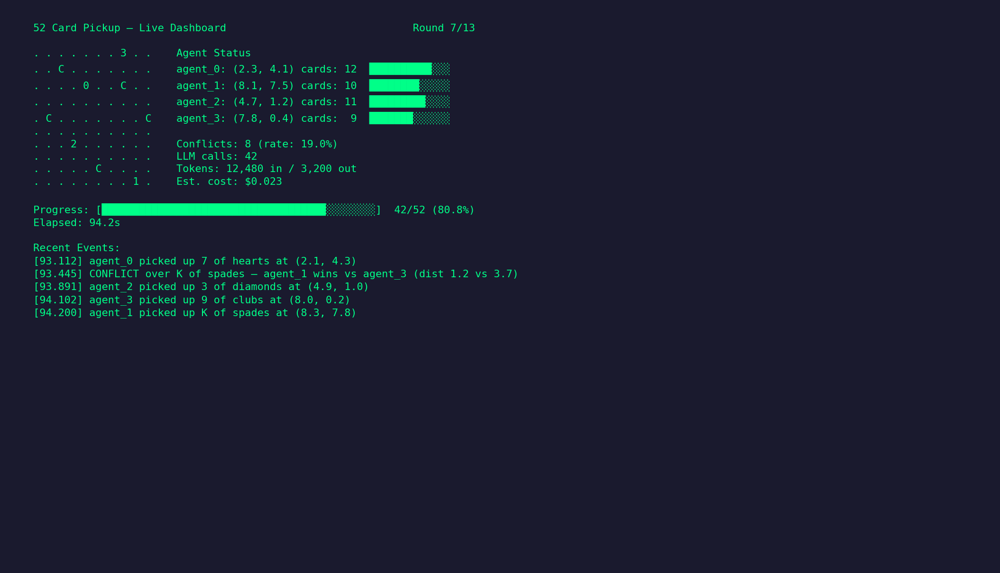
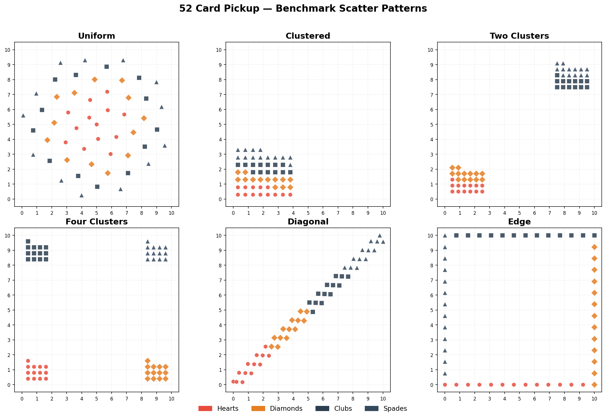

# 52 Card Pickup — Multi-Agent Simulation

[](https://github.com/violethawk/Fifty-Two-Card-Pickup/actions/workflows/ci.yml)

[](LICENSE)

The canonical "hello world" for multi-agent LLM systems. Simple enough to understand in 5 minutes, deep enough to teach every concept that matters.

52 playing cards are scattered on a 10x10 grid. Agents pick them up. The project progresses through five phases, each adding one layer of complexity — from pure Python functions to LLM-powered agents with conflict resolution, observability, and a plugin architecture.

Built with [LangGraph](https://github.com/langchain-ai/langgraph) and [Claude](https://www.anthropic.com/claude).

## Architecture



## Quick Start

```bash
git clone https://github.com/violethawk/Fifty-Two-Card-Pickup.git
cd Fifty-Two-Card-Pickup
python3 -m venv .venv
source .venv/bin/activate
pip install -r requirements.txt

# Phase 1 — no API key needed
python card_pickup.py --phase 1

# Benchmarks — all scatter patterns, all configs
python card_pickup.py --benchmark

# Web app — interactive simulation in the browser
streamlit run app.py

# Full suite — needs ANTHROPIC_API_KEY
export ANTHROPIC_API_KEY=your-key-here
python card_pickup.py
```

## Sample Output

### Phase 1 — Scaling Experiment

```
=== Phase 1: Brute-Force Scaling Experiment ===

| Agents | Avg Time (s) | Best (s) | Worst (s) | Verifier |
|--------|--------|--------|--------|--------|
| 1 | 0.3375 | 0.2933 | 0.3967 | 10/10 ✓ |
| 2 | 0.2006 | 0.1771 | 0.2337 | 10/10 ✓ |
| 4 | 0.1402 | 0.1181 | 0.1774 | 10/10 ✓ |
```

### Phase 2 — Supervisor Decision

```
| Trial | Supervisor Choice | Supervisor Time | Best Brute-Force | Match? |
|-------|-------------------|-----------------|------------------|--------|
| 1     | 4 agents          | 0.1556s         | 4 agents         | Yes    |
  Reasoning: Cards are very evenly distributed across all four quadrants
  (13-14 cards each) with a high balance ratio of 0.857, making 4 agents
  optimal to minimize travel distances within each quadrant.
```

### Phase 4 — Live TUI Dashboard



## The Five Phases

### Phase 1 — Deterministic Multi-Agent Orchestration

Pure Python, pure LangGraph. Four agents (Scatter, Timer, Pickup, Verifier) operate on shared state. No LLMs. A scaling experiment compares 1, 2, and 4 pickup agents with simulated travel cost.

**Key concepts:** Agent roles, shared state, sequential/parallel execution, constraint verification.

### Phase 2 — LLM-Powered Supervisor

A Claude Sonnet supervisor analyzes the scatter pattern (quadrant density, spatial spread, nearest-neighbor distance) and decides how many pickup agents to deploy. Workers stay deterministic.

**Key concepts:** Hybrid architecture, LLM as decision-maker, strategic reasoning, human-readable rationale.

### Phase 3 — LLM-Powered Pickup Agents

Pickup agents get their own LLM (Claude Haiku, for cost efficiency). Each round: agents plan moves, broadcast intentions, resolve conflicts (closest agent wins), and execute. No fixed regions — agents share the whole grid.

**Key concepts:** Agent autonomy, conflict detection/resolution, inter-agent communication, intelligence vs. overhead tradeoff.

### Phase 4 — Observability and Governance

Event logging records every action. Runtime governance checks enforce invariants after every round (card count, no double pickup, monotonic progress). Performance metrics, anomaly detection, and a live terminal TUI dashboard.

**Key concepts:** Multi-agent observability, audit trails, governance guardrails, monitoring vs. governance.

### Phase 5 — Extensibility and Teaching

Benchmark suite with 6 scatter patterns. Plugin architecture for swapping LLM providers and pickup strategies. Tutorial series, "Add Your Own Agent" guide, and blog post.

**Key concepts:** Reproducible benchmarking, extensibility, progressive teaching.

## Agents

| Agent | Phase | Role |
|-------|-------|------|
| Scatter | 1 | Places 52 cards at random positions on a 10x10 grid |
| Timer | 1 | Records start/stop timestamps around pickup |
| Pickup | 1 | Greedy nearest-neighbor pickup with region partitioning |
| Verifier | 1 | Checks 52 unique cards, all picked up, no duplicates |
| Supervisor | 2 | LLM decides how many pickup agents to deploy |
| LLM Pickup | 3 | LLM-powered agents with planning and conflict resolution |

## Benchmark Patterns



| Pattern | Description | Best Config |
|---------|-------------|-------------|
| `uniform` | Golden-ratio spiral across grid | 4 agents |
| `clustered` | All cards in bottom-left corner | 1 agent |
| `two_clusters` | Cards near (1,1) and (9,9) | 2 agents |
| `four_clusters` | 13 cards per quadrant corner | 4 agents |
| `diagonal` | Cards along (0,0)-(10,10) diagonal | 4 agents |
| `edge` | Cards along grid perimeter | 4 agents |

Run with `python card_pickup.py --benchmark`. Generate visualizations with `python visualize.py`.

## CLI Reference

```
python card_pickup.py [options]

Options:
  --phase {1,2,3}        Run only the specified phase (default: all)
  --benchmark            Run benchmark suite across all scatter patterns
  --dashboard            Enable live terminal TUI dashboard
  --save-log             Save event logs to JSON files
  --replay FILE          Replay a saved event log through the dashboard
  --strategy {greedy,llm}  Pickup strategy plugin (default: greedy)
  --provider {anthropic,mock}  LLM provider plugin (default: anthropic)
```

## Project Structure

```
card_pickup.py          Core simulation: agents, state, LangGraph pipeline
observability.py        Event logging, governance, metrics, TUI dashboard
benchmarks.py           Scatter patterns and benchmark runner
plugins.py              LLM provider and pickup strategy interfaces
visualize.py            Generate PNG visualizations of scatter patterns
app.py                  Streamlit web app — interactive simulation in the browser
tests/                  Unit tests (35 tests, no API key needed)
images/                 Generated scatter pattern and architecture diagrams
prompts/                Tier 2 implementation prompts for each phase
docs/
  tutorial_phase_1.md   Tutorial: deterministic agents
  tutorial_phase_2.md   Tutorial: LLM supervisor
  tutorial_phase_3.md   Tutorial: LLM pickup agents
  tutorial_phase_4.md   Tutorial: observability and governance
  tutorial_phase_5.md   Tutorial: extensibility and plugins
  add_your_own_agent.md Step-by-step guide to adding a new agent
  blog_post.md          "52 Card Pickup: The Multi-Agent Hello World"
52_Card_Pickup_Roadmap.md  Product roadmap (Phases 0-5)
requirements.txt        Dependencies: langgraph, anthropic, matplotlib, pytest
```

## Dependencies

- **langgraph** — state graph orchestration
- **anthropic** — Claude API for supervisor and LLM agents
- **matplotlib** — scatter pattern visualizations
- **streamlit** — interactive web app
- **pytest** — unit tests
- Python 3.11+ stdlib (`curses`, `concurrent.futures`, `argparse`)

## Extending the Project

**Add a new agent:** See [docs/add_your_own_agent.md](docs/add_your_own_agent.md) for a step-by-step guide.

**Add a new LLM provider:** Implement the `LLMProvider` interface in `plugins.py` and register it in the `PROVIDERS` dict.

**Add a new strategy:** Implement the `PickupStrategy` interface in `plugins.py` and register it in the `STRATEGIES` dict.

**Add a new benchmark pattern:** Write a function returning `List[Card]` in `benchmarks.py` and add it to the `PATTERNS` dict.

## License

[MIT](LICENSE)
