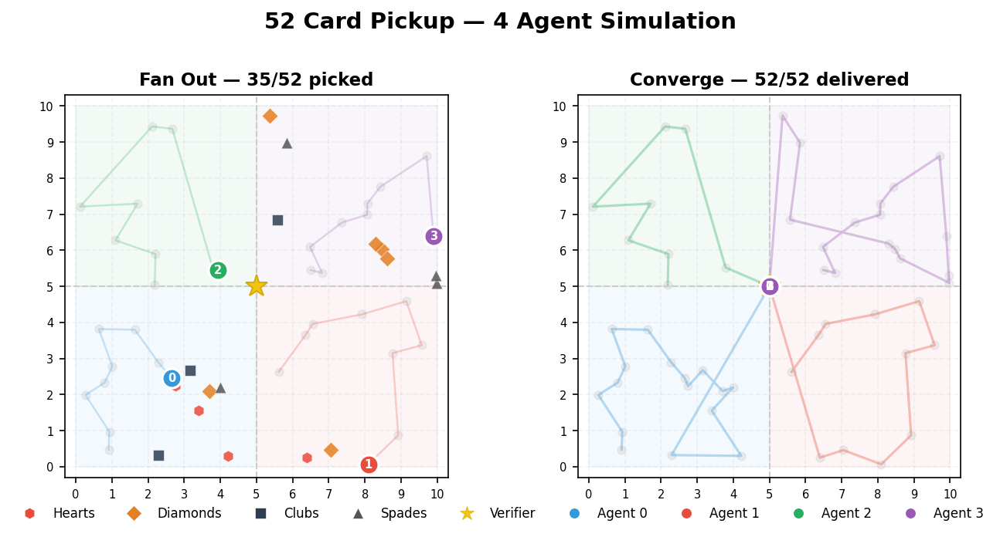

# 52 Card Pickup — Multi-Agent Simulation

[](https://github.com/violethawk/Fifty-Two-Card-Pickup/actions/workflows/ci.yml)

[](LICENSE)
[](https://fifty-two-card-pickup-8jejcgq3c4mwhdkp3emyb3.streamlit.app/)

The canonical "hello world" for multi-agent LLM systems. Simple enough to understand in 5 minutes, deep enough to teach every concept that matters.

**What you'll learn:**
- Multi-agent orchestration with shared state (LangGraph)
- Fan-out/convergence patterns with real cost tradeoffs
- LLM-as-supervisor and LLM-as-worker architectures
- Conflict resolution, observability, and governance guardrails
- Reproducible benchmarking across scatter patterns

52 playing cards are scattered on a 10x10 grid. Agents fan out to pick them up, then converge on a central verifier station to deliver their cards. The project progresses through five phases, each adding one layer of complexity — from pure Python functions to LLM-powered agents with conflict resolution, observability, and a plugin architecture.

Built with [LangGraph](https://github.com/langchain-ai/langgraph) and [Claude](https://www.anthropic.com/claude).

**[Try the live demo](https://fifty-two-card-pickup-8jejcgq3c4mwhdkp3emyb3.streamlit.app/)** — no install needed.

## Architecture


The pipeline has two core phases: **Fan Out** (agents scatter to pick up cards in their assigned regions) and **Converge** (agents travel to the central verifier station to deliver). The delivery mechanic adds a meaningful cost tradeoff — more agents pick up faster but spend more time traveling back to the verifier, changing which configurations are optimal for each scatter pattern.

## Interactive Web App



The Streamlit app lets you run simulations interactively with animated pickup and delivery, agent trails, a compare mode for side-by-side agent configurations, and a full benchmark suite.

```bash
streamlit run app.py
```

Or use the **[live demo](https://fifty-two-card-pickup-8jejcgq3c4mwhdkp3emyb3.streamlit.app/)**.

## Quick Start

```bash
git clone https://github.com/violethawk/Fifty-Two-Card-Pickup.git
cd Fifty-Two-Card-Pickup
python3 -m venv .venv
source .venv/bin/activate
pip install -r requirements.txt

# Phase 1 — no API key needed
python card_pickup.py --phase 1

# Benchmarks — all scatter patterns, all configs
python card_pickup.py --benchmark

# Full suite — needs ANTHROPIC_API_KEY
export ANTHROPIC_API_KEY=your-key-here
python card_pickup.py
```

## Sample Output

### Phase 1 — Scaling Experiment

```
=== Phase 1: Brute-Force Scaling Experiment ===

| Agents | Avg Time (s) | Best (s) | Worst (s) | Verifier |
|--------|--------|--------|--------|--------|
| 1 | 0.3589 | 0.2972 | 0.4224 | 10/10 ✓ |
| 2 | 0.2496 | 0.2226 | 0.2759 | 10/10 ✓ |
| 4 | 0.2224 | 0.1977 | 0.2482 | 10/10 ✓ |
```

More agents pick up faster, but diminishing returns appear due to delivery cost — 4 agents is only 11% faster than 2, compared to the 30% jump from 1 to 2.

### Phase 2 — Supervisor Decision

The Claude Sonnet supervisor analyzes scatter metrics and chooses an agent count. With the delivery mechanic, the supervisor must weigh pickup speed against delivery distance:

```
| Trial | Supervisor Choice | Supervisor Time | Best Brute-Force | Match? |
|-------|-------------------|-----------------|------------------|--------|
| 1     | 2 agents          | 0.1556s         | 2 agents         | Yes    |
  Reasoning: Cards are spread across the grid with moderate clustering.
  Two agents balances pickup parallelism against the delivery cost
  from each agent's final position to the central verifier.
```

### Phase 4 — Live TUI Dashboard


## Benchmark Patterns


| Pattern | Description | Best | Pickup | Delivery | Total | Why |
|---------|-------------|------|--------|----------|-------|-----|
| `uniform` | Golden-ratio spiral | 4 | 0.1454s | 0.0983s | 0.2437s | Cards near center, delivery is cheap |
| `clustered` | Bottom-left corner | 1 | 0.1483s | 0.0263s | 0.1746s | Short pickup; extra agents waste time on delivery |
| `two_clusters` | Near (1,1) and (9,9) | 1 | 0.1684s | 0.0317s | 0.2000s | Far corners penalize multi-agent delivery |
| `four_clusters` | 13 per quadrant corner | 2 | 0.1458s | 0.0633s | 0.2090s | Balances speed vs. delivery from corners |
| `diagonal` | Along (0,0)-(10,10) | 2 | 0.1463s | 0.0107s | 0.1570s | Cards pass near center, delivery is cheap |
| `edge` | Grid perimeter | 2 | 0.1378s | 0.0526s | 0.1903s | Perimeter-to-center cost favors fewer agents |

Run with `python card_pickup.py --benchmark`. Generate visualizations with `python visualize.py`.

## The Five Phases

### Phase 1 — Deterministic Multi-Agent Orchestration

Pure Python, pure LangGraph. Agents operate on shared state: Scatter places cards, Pickup agents fan out to collect them (greedy nearest-neighbor with region partitioning), then agents deliver cards to the central Verifier station. No LLMs. A scaling experiment compares 1, 2, and 4 pickup agents with simulated travel cost.

**Key concepts:** Agent roles, shared state, fan-out/convergence, constraint verification, delivery cost tradeoffs.

### Phase 2 — LLM-Powered Supervisor

A Claude Sonnet supervisor analyzes the scatter pattern (quadrant density, spatial spread, nearest-neighbor distance) and decides how many pickup agents to deploy. Workers stay deterministic. The supervisor sits above the pipeline as an optional oversight layer.

**Key concepts:** Hybrid architecture, LLM as decision-maker, strategic reasoning, human-readable rationale.

### Phase 3 — LLM-Powered Pickup Agents

Pickup agents get their own LLM (Claude Haiku, for cost efficiency). Each round: agents plan moves, broadcast intentions, resolve conflicts (closest agent wins), and execute. No fixed regions — agents share the whole grid.

**Key concepts:** Agent autonomy, conflict detection/resolution, inter-agent communication, intelligence vs. overhead tradeoff.

### Phase 4 — Observability and Governance

Event logging records every action. Runtime governance checks enforce invariants after every round (card count, no double pickup, monotonic progress). Performance metrics, anomaly detection, and a live terminal TUI dashboard.

**Key concepts:** Multi-agent observability, audit trails, governance guardrails, monitoring vs. governance.

### Phase 5 — Extensibility and Teaching

Benchmark suite with 6 scatter patterns. Plugin architecture for swapping LLM providers and pickup strategies. Tutorial series, "Add Your Own Agent" guide, and blog post.

**Key concepts:** Reproducible benchmarking, extensibility, progressive teaching.

## Agents

| Agent | Phase | Role |
|-------|-------|------|
| Scatter | 1 | Places 52 cards at random positions on a 10x10 grid |
| Timer | 1 | Records start/stop timestamps around pickup + delivery |
| Pickup | 1 | Greedy nearest-neighbor pickup with region partitioning |
| Delivery | 1 | Agents converge on verifier station (5, 5) with travel cost |
| Verifier | 1 | Checks 52 unique cards, all picked up and delivered, no duplicates |
| Supervisor | 2 | LLM analyzes scatter pattern and decides agent count (optional) |
| LLM Pickup | 3 | LLM-powered agents with planning and conflict resolution |

## CLI Reference

```
python card_pickup.py [options]

Options:
  --phase {1,2,3}        Run only the specified phase (default: all)
  --benchmark            Run benchmark suite across all scatter patterns
  --save-log             Save event logs to JSON files
  --dashboard            Enable live terminal TUI dashboard
  --replay FILE          Replay a saved event log through the dashboard
  --strategy {greedy,llm}  Pickup strategy plugin (default: greedy)
  --provider {anthropic,mock}  LLM provider plugin (default: anthropic)
```

## Project Structure

```
card_pickup.py          Core simulation: agents, state, LangGraph pipeline
observability.py        Event logging, governance, metrics, TUI dashboard
benchmarks.py           Scatter patterns and benchmark runner
plugins.py              LLM provider and pickup strategy interfaces
visualize.py            Generate PNG visualizations of scatter patterns
app.py                  Streamlit web app — interactive simulation
tests/                  Unit tests (38 tests, no API key needed)
images/                 Generated scatter pattern and architecture diagrams
prompts/                Tier 2 implementation prompts for each phase
docs/
  tutorial_phase_1.md   Tutorial: deterministic agents
  tutorial_phase_2.md   Tutorial: LLM supervisor
  tutorial_phase_3.md   Tutorial: LLM pickup agents
  tutorial_phase_4.md   Tutorial: observability and governance
  tutorial_phase_5.md   Tutorial: extensibility and plugins
  add_your_own_agent.md Step-by-step guide to adding a new agent
  blog_post.md          "52 Card Pickup: The Multi-Agent Hello World"
52_Card_Pickup_Roadmap.md  Product roadmap (Phases 0-5)
requirements.txt        Dependencies: langgraph, anthropic, matplotlib, pytest
```

## Dependencies

- **langgraph** — state graph orchestration
- **anthropic** — Claude API for supervisor and LLM agents
- **matplotlib** — scatter pattern visualizations
- **streamlit** — interactive web app
- **pytest** — unit tests
- Python 3.11+ stdlib (`curses`, `concurrent.futures`, `argparse`)

## Extending the Project

**Add a new agent:** See [docs/add_your_own_agent.md](docs/add_your_own_agent.md) for a step-by-step guide.

**Add a new LLM provider:** Implement the `LLMProvider` interface in `plugins.py` and register it in the `PROVIDERS` dict.

**Add a new strategy:** Implement the `PickupStrategy` interface in `plugins.py` and register it in the `STRATEGIES` dict.

**Add a new benchmark pattern:** Write a function returning `List[Card]` in `benchmarks.py` and add it to the `PATTERNS` dict.

## Contributing

Contributions are welcome! This project is designed as a teaching tool, so clarity matters more than cleverness.

1. Fork the repo and create a feature branch
2. Make your changes — keep them focused and well-tested
3. Run `python -m pytest tests/` to verify all 38 tests pass
4. Run `python card_pickup.py --benchmark` to check nothing regressed
5. Open a PR with a clear description of what and why

Good first contributions: new scatter patterns, new pickup strategies, documentation improvements, or Streamlit app enhancements.

## License

[MIT](LICENSE)
